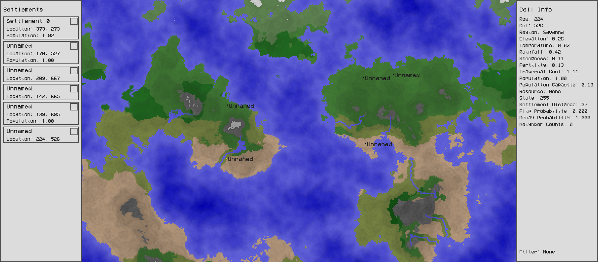
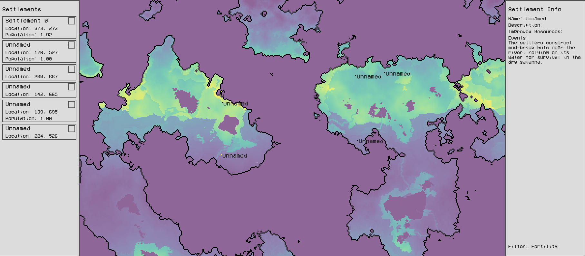

# World Simulator

An interactive, grid-based Python simulation of procedural terrain generation, state territorial expansion and storytelling through integrated LLM calls.  
This project combines large-scale data handling and visualisation, cellular automata-like behaviour, interactive elements and LLM calls to simulate a world and it's history.

## Features

### Procedural World Generation

- Uses perlin noise to generate two 2D base maps of elevation and rainfall and a bell curve distribution for temperature map.  
- Combines these three base maps to create further 2D data maps including steepness, soil fertility, traversal cost and population capacity.  
- Uses a region classification system driven by a configurable JSON ruleset to determine region types (e.g. forest, desert, savanna, marsh).  
- Resources (e.g. fish, ore, lumber) are distributed across the world using configurable rulesets with precise control over distribution based on region classifications and data map values.  

### Territorial Expansion

- States expand probabilistically based on neighbour counts, traversal costs and capacity limits.  
- Includes decay mechanics to make state territories reactive to the environment.   

### Settlement Growth

- Settlements discover and improve local resources, populations grow over time and new settlements can be founded.

### Event System with LLM Integration

- Asynchronous LLM calls using DeepSeek API generate narrative descriptions of events that occur in the world (e.g. settlements being founded, settlement growth, state growth).
- Previous event descriptions are fed into the LLM to be built upon to produce stories that progress over time.
- Raw data is converted into semantic descriptions to give to the LLM so it has an understanding of the world and the environment.

### Efficient Design using NumPy

- Each 2D data map is stored as a NumPy array and vectorised operations are used for efficient data manipulation.
- Simulation can run at 60fps at map sizes exceeding 10,000,000 cells (each with 12 points of data).

### Interactive GUI using PyGame

- Sidebars display dynamic cell, settlement and state information based on the selected cell.
- Includes expandable boxes and clickable buttons.
- Camera control to explore the world.
- Also includes filters which display heatmaps of the different data maps to visualise data better.

### Object-Oriented Architecture

- Modular controllers are used for interaction between the world, events, camera and UI to ensure encapsulation.

## What This Project Demonstrates

- **Algorithm Design** - probabilistic state expansion, resource distribution, procedural region rules.
- **Performance Optimisation** - vectorised NumPy for 10M+ cell maps.
- **Asynchronous Programming** - for background LLM calls.
- **Clean Architecture** - OOP controllers with modular responsibilites.
- **AI Integration** - Prompt engineering and efficient token usage.
- **Interactive Design** - GUI for viewing and interacting with a dynamic world.

## Showcase

### Example of a map with multiple settlements (all named 'Unnamed')  
The left sidebar contains a list of all settlements in the world and the right sidebar displays data on the selected cell

### The same map with the 'soil fertility' filter selected.
This is one of the nine filters used to visualise data. As you can see, grassland areas and areas near coasts or rivers are more fertile.

### Example of State Territory Growth.
Each colour represents the area a state owns. Growth is based on settlement populations and traversal costs.

