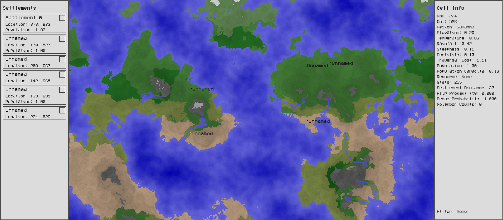
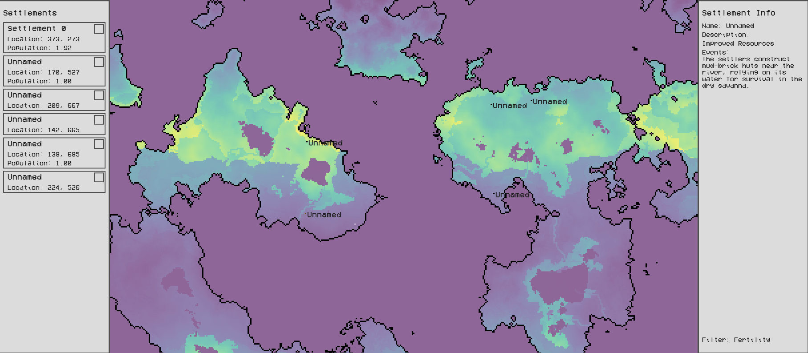
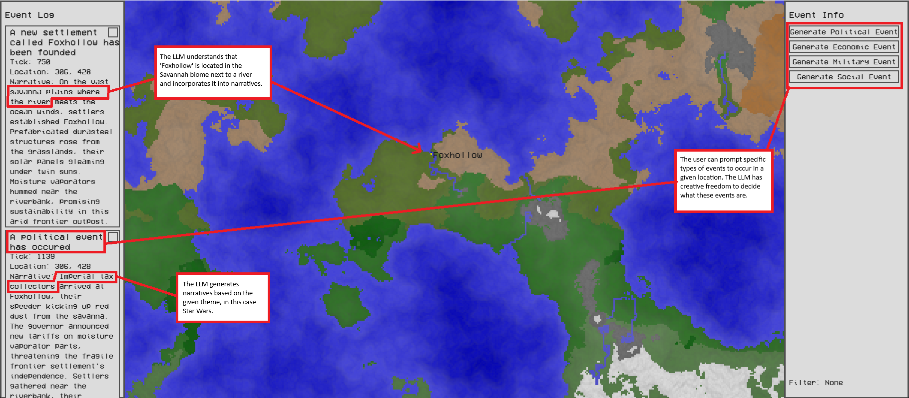

# World Simulator

An interactive, grid-based Python simulation of procedural terrain generation, state territorial expansion and storytelling through integrated LLM calls.  
This project combines large-scale data handling and visualisation, cellular automata-like behaviour, interactive elements and LLM calls to simulate a world and it's history.

## Features

### Procedural World Generation

- Uses perlin noise to generate two 2D base maps of elevation and rainfall and a bell curve distribution for temperature map.  
- Combines these three base maps to create further 2D data maps including steepness, soil fertility, traversal cost and population capacity.  
- Uses a region classification system driven by a configurable JSON ruleset to determine region types (e.g. forest, desert, savanna, marsh).  
- Resources (e.g. fish, ore, lumber) are distributed across the world using configurable rulesets with precise control over distribution based on region classifications and data map values.  

### Territorial Expansion

- States expand probabilistically based on neighbour counts, traversal costs and capacity limits.  
- Includes decay mechanics to make state territories reactive to the environment.   

### Settlement Growth

- Settlements discover and improve local resources, populations grow over time and new settlements can be founded.

### 'Procedural Story Generation' using DeepSeek's API 

- Asynchronous LLM calls using DeepSeek API generate narrative descriptions of events that occur in the world (e.g. settlements being founded, settlement growth, state growth).
- The LLM is given a global theme to base the story around
- Previous event descriptions are fed into the LLM to be built upon to produce stories that progress over time.
- Raw data is converted into semantic descriptions to give to the LLM so it has an understanding of the world and the environment.

### Efficient Design using NumPy

- Each 2D data map is stored as a NumPy array and vectorised operations are used for efficient data manipulation.
- Simulation can run at 60fps at map sizes exceeding 10,000,000 cells (each with 12 points of data).

### Interactive GUI using PyGame

- Sidebars display dynamic cell, settlement and state information based on the selected cell.
- Includes expandable boxes and clickable buttons.
- Camera control to explore the world.
- Also includes filters which display heatmaps of the different data maps to visualise data better.

## Showcase

### Example of a map with multiple settlements (all named 'Unnamed')  
The left sidebar contains a list of all settlements in the world and the right sidebar displays data on the selected cell

### The same map with the 'soil fertility' filter selected.
This is one of the nine filters used to visualise data. As you can see, grassland areas and areas near coasts or rivers are more fertile.

### A different map, showcasing the LLM story generation with explanations
In this example, the world theme was given as 'Star Wars'. A single settlement was placed in the savannah biome and then a political event was prompted. 
As you can see, the story the LLM generates is Star Wars themed, and makes reference to the settlement's environment (being in the savannah and next to a river).

## How LLM Interactions Work
Here is the system role given to the LLM:   
> *You are the worldbuilder of a realistic world simulation.   
The world is based on {LLM_THEME}.   
Write one grounded narrative in that world. The narrative should describe the given event.   
If the event is unspecified, you have creative freedom to generate a narrative, but it must be based solely on the given context and world theme.   
Narratives should be no longer than 50 words.   
Keep the tone consistent with the themes culture, technology, and politics.   
Return JSON with 'narrative' and 'actions'.   
Here is a list of possible actions. Actions can be left empty.   
{LLM_ACTIONS_NAMES}*   

Here is a prompt that was given to the LLM in the 'Star Wars' themed world used in the screenshot above:   
> *Event:   
A political event has occured   
Environment context:   
The region is savanna; It is adjacent to savanna; It is adjacent to river; There is some ocean region in the area; There is some arid region in the area; Majority of the surrounding region is savanna; There is some river region in the area   
Most recent event in the area:   
On the vast savanna plains where the river meets the ocean winds, settlers established Foxhollow. Prefabricated durasteel structures rose from the grasslands, their solar panels gleaming under twin suns. Moisture vaporators hummed near the riverbank, promising sustainability in this arid frontier outpost.*

The *environment context* is formed by counting every biome around the event's location by a radius of 1 cell (for adjacency) and 5 cells (for vicinity).   
The ratio of each biome in the vicinity determines how each biome is described e.g. *There is some {biome} in the area*.   
The *Most recent event in the area* is the most recent response that the LLM generated within a radius of 10 cells. Feeding this back in gets the LLM to build off of its previous events to create dynamic storylines.

Here is the response from the LLM to the prompt:
> *Imperial tax collectors arrived at Foxhollow, their speeder kicking up red dust from the savanna. The governor announced new tariffs on moisture vaporator parts, threatening the fragile frontier settlement's independence. Settlers gathered near the riverbank, their murmurs barely audible over the hum of vital machinery.   
[{'action': 'decrease_cohesion', 'impact': 'medium'}]*

The LLM returns a list of *actions* along with the *narrative*. This allows the narratives that the LLM comes up with to have actual impacts on the simulation.   
The actions are picked from a list of possible actions that is given to the LLM in the system role prompt. An impact of low, medium and high gives the LLM finer control over how events affect the world.    
Each action's effects are defined in JSON format. In this example, the settlement's cohesion will be lowered by 0.2. 
